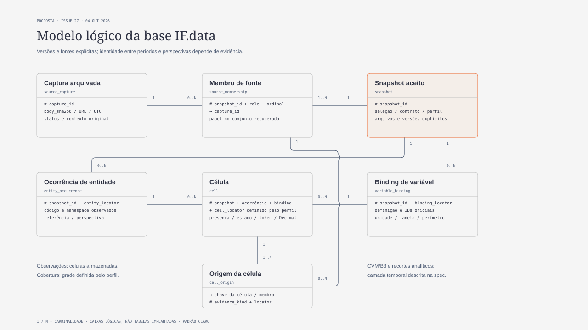

# Modelo lógico da base IF.data

**Estado: proposta para revisão de João.** Entrega documental da [Issue 27](https://github.com/joaosantossgp/brazilian_banks_data_quality/issues/27), base de inspeção `2694bd9da321f0f24199d8b28544114533cd2042`. Consolida decisões existentes e propõe nomes, grão, chaves e relações para implementações futuras. Não implanta tabelas/views, altera manifests, migra contratos aceitos ou autoriza coleta. A aprovação desta especificação precede o plano de implementação; método, amostra e equivalências econômicas permanecem com João/orientador.

## Objetivo e decisões preservadas

Uma base reutilizável que conserva observações oficiais e suas versões, permite consultar períodos/perspectivas explicitamente e recebe recortes acadêmicos posteriores. A direção técnica é trimestral 2010–2026, financeiro principal, prudencial e individual complementares; isso não significa história adquirida ou comparável. A monografia conserva 2010–2024.

O [ADR 0001](../../adr/0001-duckdb-parquet.md) decide Python + Parquet + DuckDB local, sem servidor ou cópia integral persistida em `.duckdb`. O [desenho anterior](../../engineering/brainstorming-2010-2026-20261002.md#segunda-seção-aprovada-atualização-revisões-validação-e-falhas) preserva atualização sob comando, revalidação histórica dirigida, versões imutáveis, validação por regime e falhas visíveis. Fontes financeiras são IF.data; CVM/B3 fornecem somente metadados. Não se escolhe cadência de coleta/revisão neste documento.

## Estado real e limites dos contratos

| Conjunto existente | O que prova | O que não prova |
|---|---|---|
| Individual/Resumo 201012, 202312, 202412; [inventário e replay](../../engineering/expansion-execution.md) | 40.904 observações e artefatos aceitos/reproduzidos | Identidade financeira/prudencial, precisão perdida antes do inventário ou toda a história |
| [Parquet individual](../../engineering/offline-parquet-20261003.md), `ifdata-inventory-parquet-v1` | Conversão exata dos tokens aceitos, metadados e consulta local | Novo contrato financeiro ou evidência primária adicional |
| [Financeiro 1005 / Resumo 92 / 202412](../../engineering/financial-snapshot-202412-execution-20261003.md), `ifdata-financial-snapshot-202412-v1` | 1.422 registros, oito variáveis, 11.334 observações; grade 11.376 e 42 posições sem armazenamento | Parquet financeiro, vintage conjunta, universo elegível ou correção econômica dos valores |
| [Dossiê de identidade](../../engineering/capital-aberto-identity-dossier.md) e `metadata.py` | Evidências e incertezas temporais separadas | Confirmação dos oito vínculos desconhecidos ou listagem histórica a partir do cadastro atual |

O modelo abaixo é **lógico**, sem correspondência automática de uma caixa a um arquivo/tabela. Implementações físicas futuras podem materializar a grade uma vez e expor observações/cobertura por views. Não repetir os mesmos fatos em bases concorrentes; o manifest aceito delimita cada conjunto físico. Contratos legados continuam legados até uma migração aprovada, com equivalência verificável.

## Alternativas e recomendação

| Alternativa | Benefício | Risco/custo |
|---|---|---|
| Painel único com entidade/variável universais e valores atualizados no lugar | Consulta curta | Perde revisões e presume identidade/equivalência que a evidência não sustenta |
| Contratos independentes sem envelope comum | Preserva cada aquisição | Cada consumidor precisa reinventar proveniência, seleção de versões e limites de joins |
| **Núcleo comum por snapshot, com bindings específicos de fonte/regime — recomendado** | Proveniência uniforme e interfaces de consulta comuns, mantendo diferenças oficiais | Exige adapters explícitos e seleção de snapshots; harmonização continua contrato separado |

O núcleo recomendado reaproveita arquivo/proveniência, validação, Parquet e consultas já existentes. Os nomes e chaves abaixo são proposta técnica; só o armazenamento do ADR e os limites preservacionais acima são decisões já aceitas.

## Núcleo e relações

[Versão PNG](../../agents/assets/logical-data-model.png). Padrão claro de `diagram-design`, ER `doc-wide`, sete entidades e oito relações; o diagrama omite campos extensos, metadados CVM/B3 e recortes acadêmicos, definidos no texto. Fontes locais/offline podem substituir a tipografia do SVG; PNG conserva a renderização inspecionada.

Alternativa textual: uma **captura** pode participar de vários snapshots por **membros de fonte**; cada snapshot aceito tem um ou mais membros. O snapshot delimita **ocorrências de entidade** e **bindings de variável**. Cada **célula** referencia exatamente uma ocorrência e um binding do mesmo snapshot. Uma célula tem uma ou mais **origens**, cada uma referenciando um membro de fonte daquele snapshot. Uma captura/membro/ocorrência/binding pode ter zero ou muitas utilizações, sem identidade transversal implícita.

| Conjunto lógico | Grão e chave proposta | Conteúdo e restrições |
|---|---|---|
| `source_capture` | Uma recuperação arquivada; `capture_id = SHA256(bytes originais do manifest de aquisição)` | URL/parâmetros, UTC de recuperação, status/outcome/diagnósticos, hash/tamanho do corpo, contexto original e texto/estado da geração quando disponível. Capturas distintas podem ter corpo idêntico. Falhas ficam aqui, sem observações fabricadas. |
| `snapshot` | Um conjunto aceito sob um contrato e seleção; `snapshot_id = SHA256(bytes do manifest final aceito)` | Referência, namespace de perspectiva/relatório, contrato, código/perfil, lista de arquivos/hash, contagens, limites e membros exatos. Cada snapshot tem uma seleção declarada; um contrato legado com várias referências deve declarar suas referências, sem simular um snapshot nativo de uma só referência. |
| `source_membership` | Um papel de uma captura no snapshot; `(snapshot_id, role, ordinal)` | FK para captura, papel e localizador do manifest. Um perfil exige seus papéis/cardinalidades, como as cinco fontes financeiras atuais. Não substituir por glob ou escolher uma captura pelo horário mais recente. |
| `entity_occurrence` | Uma linha cadastral/admitida naquele snapshot; `(snapshot_id, entity_locator)` | Código literal, namespace de origem/perspectiva, referência, atributos e origem. Localizador vem da fonte/contrato; `source_code` é atributo opaco, cuja unicidade no recorte depende do perfil. Não é CNPJ, emissor, holding ou identidade histórica universal. |
| `variable_binding` | Uma ocorrência de variável na estrutura declarada; `(snapshot_id, binding_locator)` | Localizador da coluna/definição, IDs oficiais e namespaces, `ifd/td/a/lid/fid` quando disponíveis, conceito/notas, unidade e sua base, janela/perímetro/regime e estados desconhecidos. Dois bindings não se tornam iguais por nome ou ID coincidente. |
| `cell` | Uma posição definida pelo perfil dentro do snapshot; `(snapshot_id, entity_locator, binding_locator, cell_locator)` | Presença, estado do valor, token/tipo fonte, projeção Decimal quando exata, janela/perímetro e origens. `cell_locator` distingue posições nativas legitimamente múltiplas; duplicata da mesma chave é erro, nunca deduplicação silenciosa. Perfil financeiro atual declara uma posição por ocorrência/binding, sem permitir multiplicidade para esconder duplicatas. |
| `cell_origin` | Uma evidência de valor, presença ou interpretação da célula; chave da célula + `(evidence_kind, role, ordinal, locator)` | FK para membro no mesmo snapshot e localizador no corpo imutável. `evidence_kind` distingue valor armazenado, busca sem célula, definição/catálogo e base de unidade/janela. Não atribuir pointer de valor a uma ausência; fonte/esquema incompleto não satisfaz prova de ausência. |

Todos os FKs conceituais para ocorrência, binding e membro devem concordar em `snapshot_id`. Ocorrência e binding conservam referência e namespace de perspectiva/relatório; a célula exige escopos compatíveis, inclusive em um snapshot legado com várias referências. Localizadores de um adapter multirreferência devem distinguir a referência; não associar ocorrência de um período a binding de outro por pertencerem ao mesmo manifest. O índice externo ou a projeção de leitura calcula o hash do manifest; não inseri-lo no próprio arquivo que ele identifica, evitando autorreferência. Hashes identificam bytes/integridade, não autenticidade do autor, identidade econômica ou aprovação metodológica.

### Localizadores e identidade

O perfil define localizadores e sua validação. No financeiro atual, a ocorrência cadastral é `/n` em C5, o binding usa a coluna do relatório e a definição do dicionário, e o valor usa o pointer N1 ou `c16/c17`. Código `c0` e lexema `e` só se associam por igualdade literal no namespace/perspectiva/referência admitidos; o guard atual rejeita padding/colisão. Lucro mantém `ifd=79718` e `lid=78187`.

Nos legados individuais, `source_row`, `account`, nomes/grupos e namespace de `institutions.csv` conservam seu alcance original. Um adapter pode representar a posição já aceita por seu localizador legado, mas deve marcar ausentes os IDs/pointers/vintage não observados; não inventar `ifd`, `lid` ou precisão primária a partir dos nomes. Duplicatas inventariadas no legado permanecem visíveis. O adapter precisa de desenho/aceite próprios e não é executado por esta spec.

Identidade entre períodos/perspectivas exige relação comprovada. Mesmo nome, mesmo código ou CNPJ candidato não cria entidade canônica nem autoriza somar conglomerado e seus membros individuais.

## Presença, valores e cobertura

**Observação** é projeção das células efetivamente armazenadas; pode ter NA, NI, null ou vazio da fonte. **Cobertura** descreve a grade esperada sob um perfil/população explícitos. Esses conjuntos têm denominadores próprios, sem promover população anunciada ou falha HTTP a população adquirida.

No perfil financeiro atual: `stored`, `entity_not_stored`, `information_not_stored`; ausências diretas têm `unobserved_cell` e não têm token numérico. Estados de valor existentes permanecem `numeric`, `zero`, `NA`, `NI`, `NA_percent`, `NI_percent`, `json_null`, `literal_null`, `blank`. Valor inválido é retido na fonte/diagnóstico e rejeita a admissão afetada. Snapshot parcial, fonte/área faltante ou schema desconhecido não produz cobertura financeira aceita. Uma variável ausente da estrutura é ausência estrutural; não gerar célula NI com base em outro período.

O denominador da grade não é universal. É o roster financeiro C5/1005 neste recorte; no inventário individual existente é população/estrutura observadas, com seus limites. Evidência de cadastro não assegura existência de todos os valores e cobertura não assegura universo histórico ou elegibilidade.

Token textual e tipo fonte são conservados; Decimal é complemento, sem float/arredondamento. O tipo é dimensionado pelos tokens do conjunto a converter; precisão superior à suportada rejeita a projeção exata. No snapshot financeiro atual, o perfil medido exige `DECIMAL(35,22)`; isso não fixa esse tipo para toda a história. Valores sem número exato recebem NULL somente na projeção numérica, mantendo presença/estado/token. Uma consulta multissnapshot deve perfilar o tipo comum ou recusar a operação exata; não aceitar promoção implícita para float ou arredondamento em `UNION`.

## Tempos, revisões e escolha de versões

| Informação temporal | Significado | Limite |
|---|---|---|
| Referência | Data/período a que a publicação se refere | Não é recuperação nem janela de resultado |
| Janela do valor | Intervalo de acumulação ou data de estoque, com base/estado | Dezembro não torna lucro anual; desconhecido permanece desconhecido |
| Geração/revisão declarada | Texto/data/versão fornecidos pela fonte | Preservar texto e estado; não usar UTC de recuperação como substituto |
| Recuperação UTC | Quando uma captura ocorreu | Capturas com horários distintos não provam vintage conjunta |
| Execução/aceite | Quando e sob qual código/perfil um derivado foi produzido | Não modifica referência, geração ou condição histórica da entidade |
| Validade de metadado/vínculo | Data ou intervalo explicitamente sustentados pela evidência | Não estender para períodos vizinhos ou supor continuidade |

Atualização normal e revisão histórica dirigida são operações distintas já aprovadas em desenho. Uma nova captura não sobrescreve a anterior; um corpo idêntico pode ser deduplicado fisicamente **apenas conservando todas as capturas e seus contextos**. Nova versão de bytes não implica mudança econômica; corpo igual não garante recuperação/vintage simultâneas.

Replay pode ter novo `snapshot_id` porque o manifest contém UTC de execução; os resultados e o conjunto de evidências devem ser comparáveis por hashes/digest da projeção. Não inventar uma identidade econômica comum para deduplicar replays. Um índice de execuções pode registrar equivalência de entradas/código/perfil/saídas conferida, mas a codificação de um `content_id` está fora desta proposta e não é condição para o primeiro adapter.

Consultas recebem **lista explícita de snapshots** com hashes esperados e papéis. Para séries ordinárias, exigir uma seleção por referência/perspectiva/relatório/contrato-perfil compatível; duas revisões para a mesma posição geram conflito até o consumidor indicar comparação de versões. Não há `latest` implícito. Comparar revisões usa dimensão de snapshot/captura, preserva ambas e explicita o motivo da seleção; não substitui validação de comparabilidade.

O catálogo futuro do executor registra resultados adquirido/validado/pendente/falhou e o escopo de cada etapa; não inferir estado por pasta existente. Esse catálogo é índice de dados local, não outro tracker de tarefas/Issues. Contrato/schema não interpretados mantêm raw e diagnóstico disponíveis, sem aceite comparável e sem bloquear outros recortes independentes.

## Metadados temporais, vínculos e recortes

Fora do núcleo, dois conjuntos lógicos futuros distinguem **evidência temporal de atributo** e **evidência temporal de relação**. Atributo identifica sujeito no namespace próprio, fato observado, fonte/localizador, recuperação, data/intervalo sustentados e estado desconhecido quando aplicável. Relação identifica ambos os sujeitos/namespace/códigos, tipo explícito (mesma pessoa jurídica, controle ou pertencimento), fonte/localizador e validade comprovada. Relações podem ser muitos-para-muitos; nenhum relacionamento de um-para-um entre emissor e unidade IF.data é imposto.

Reutilizar os limites de [`metadata.py`](../../../bank_quality/metadata.py): cadastro CVM atual não prova registro ininterrupto; listagem atual B3 não prova listagem histórica; `identity_evidence` valida metadados de prova, não o significado do documento nem elegibilidade. Asserções candidatas não entram como vínculos confirmados. Evidências conflitantes são conservadas e bloqueiam o join afetado até resolução explícita.

Ausência de prova não é falso/exclusão. Consultas da base mantêm todas as ocorrências admitidas; joins de metadados precisam preservar desconhecidos e evitar multiplicar fatos por relações temporais múltiplas. Somar valores após um join muitos-para-muitos exige regra própria; não fazê-lo por default.

Um **recorte analítico** é seleção documentada de snapshots, entidades/perspectivas, referência/janela e contratos de comparabilidade/método/eligibilidade, com sua decisão/evidência. É derivado e rastreável; não altera fatos oficiais. Indicadores/derivações referenciam operandos e versão da regra, preservando a observação de origem. Nenhum indicador, fórmula, filtro acadêmico ou política de exclusão é escolhido aqui. A ponte 2025, os oito vínculos desconhecidos e a amostra da monografia continuam tarefas próprias.

## Organização física e consumo propostos

Preservar destinos canônicos: `data/raw/` para corpos/capturas; `data/derived/` para admissões/inventários; `data/curated/` para snapshots Parquet; `data/runs/` para execução/auditoria. Todos permanecem locais ignorados. Paths são mecanismo físico, não identidade lógica. Sem reorganizar ou mover os artefatos aceitos.

Cada materialização futura guarda manifest de origem, seleção exata, hashes de entrada/saída, contrato/perfil/código, contagens/tipos/limites e arquivos explícitos. Novos destinos são reservados; marcador final completo aceita o conjunto. Aceite não promete transação entre vários arquivos ou durabilidade contra perda de energia. Integridade de arquivo, equivalência de projeção e conceitos/unidades/janelas são checks distintos.

Particionamento interno, compressão e nomes de views pertencem à implementação delimitada. A primeira conversão financeira pode materializar uma grade e expor `financial_cells` e `financial_observations`; esses nomes ainda são proposta, sem API implementada. Não criar catálogo global, migração universal ou fusão automática das famílias para converter 202412. Consultas DuckDB usam arquivos explícitos e validados, preservando o isolamento do contrato individual.

## Cenários que a implementação deverá provar

| Cenário | Resultado esperado |
|---|---|
| Dois manifests de recuperação com o mesmo corpo | Duas capturas preservadas; nenhum contexto perdido por deduplicação do corpo |
| Replay com mesmos resultados e UTC de execução distinta | Snapshots de execução identificáveis e equivalência de conteúdo demonstrada, sem contar fatos duas vezes por default |
| Mesmo código em 1005 e 1006, ou em dois períodos | Ocorrências separadas; join somente por contrato/evidência próprios |
| Mesmo nome/ID de variável com definição/perímetro alterados | Bindings separados; série comparável pendente de evidência/decisão |
| Relatório omite variável vs N1 omite uma célula vs fonte falha | Ausência estrutural, célula não armazenada e admissão incompleta distintos |
| Lucro 79718 consultado em N1 | Localizador 78187, janela julho–dezembro, sem escala/arredondamento ou promoção a anual |
| Dois snapshots de revisão selecionados para a mesma posição | Conflito explícito em série ordinária; comparação de revisões separada quando solicitada |
| Somente cadastro/listagem atual disponíveis | Estado histórico desconhecido; fato financeiro preservado, sem exclusão implícita |
| Relação emissor–unidade conflitante/múltipla | Join afetado pendente ou explicitamente definido; nenhum fato multiplicado/somado silenciosamente |
| União exige precisão maior que 38 dígitos | Recusa da projeção exata ou desenho alternativo aprovado; tokens preservados, sem float silencioso |
| Adapter individual não tem IDs/pointers financeiros | Limitação explícita; nenhuma fabricação ou migração automática |

## Revisão, aprovação e próxima entrega

Revisão documental confere relações/FKs/grão, cenários, correspondência aos contratos/código, links, arquitetura, privacidade e visual SVG/PNG. Suíte de software não prova implementação do modelo e não será usada como teste espelho da spec. Estados públicos de revisão/publicação ficam na Issue 27/PR; este texto não confirma remoto por si.

João deve revisar esta especificação escrita antes de tratá-la como contrato de implementação. Não é necessário decidir a amostra acadêmica para aprovar o núcleo preservacional; escolhas metodológicas e equivalências continuam pendentes. Após aprovação: planejar a conversão financeira 1005/92/202412 em Issue própria, com TDD, equivalência integral, testes de revisão/precisão/ausências/destinos e revisão independente. Adapters legados, cadastro temporal, histórico/atualização e ponte 2025 devem ter tarefas e dependências explícitas, sem implementar tudo neste primeiro lote.

Nenhuma decisão nova foi registrada como ADR aceito. O ADR 0001 continua autoridade do armazenamento; o modelo proposto é esta spec única, ligada pela arquitetura. Decisões efetivamente aprovadas com trade-off difícil de reverter poderão receber ADR específico, sem copiar a spec nem criar um modelo concorrente.
